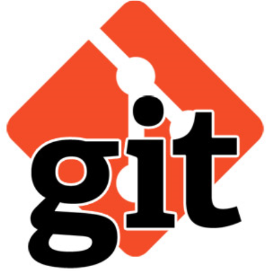

# **TTA566 - Introduction to Git**

# **Introduction**

## Links
* [Git](https://git-scm.com/) - some documentation, downloads, etc. 
* [GitHub](https://github.com/) - a free web-based Git hosting service
* [Atlassian Bitbucket](https://bitbucket.org/) - another free web-based Git hosting service
* [Gitlab at MITRE](https://gitlab.mitre.org/) - like GitHub, but inside MITRE
* [MITRE Atlassian Portal](https://login.codev.mitre.org/portal) - log in to access MITRE Codev tools
    * [Atlassian Stash](https://git.codev.mitre.org/) - like Gitlab but requires access
	
## What even is Git?
* *Git is a free and open source distributed version control system designed to handle everything from small to very large projects with speed and efficiency.*
* Makes it easy to manage project versions, among one or many authors
* Facilitates versioning, branching, and merging
* Popular

## What is a Git "repo"?
* "repo" stands for "repository"
* A data structure with information to manage a project
* To get a repo, **clone** it

## What is GitHub?
* A web-based Git hosting service
* Free
* Hosts important open source projects like: [Linux](https://github.com/torvalds/linux), [Bootstrap](https://github.com/twbs), [Node.js](https://github.com/nodejs), [JQuery](https://github.com/jquery), [Ruby on Rails](https://github.com/rails)
* [Bitbucket](https://bitbucket.org/) is similar

## Before Git...
* *Mary, Jim, and Sarah work on a project.*
* **Jim**: I've made my changes. I emailed you a zip file of the project.
* **Sarah**: Got it. I'm making my changes now.
* **Mary**: Sarah- I'll stop by with a USB stick to copy your files.
* **Jim**: I have more changes, but I'll wait for Mary to finish.

## After Git...
* **Jim**: My changes are in.
* **Sarah**: I saw that. I already merged my changes.
* **Mary**: I just pulled the latest version. My changes will be in shortly.
* **Jim**: I just pushed in more changes, but it won't affect either of you.

# **Getting Git**

## You may already have it.
```sh
user@yourmachine:~$ git --version
```

## Download it: [link](https://git-scm.com/downloads)

# **Lab 1 - Create a GitHub Repository**
* Go to [GithHub.com](https://github.com/) and sign up for a free account
* For now, consider everything **public**
* Add an avatar to your profile
* Create a new repository
    * Name it **helloworld**
	* Add a *Description*
    * Select *Public*
	* Check *Initialize this repository with a README*
* Find the HTTPS and SSH URLs to clone the repository (you will need this later)

# **Concepts**
* Make changes in your local computer's repo, then push them to the remote repo
* Developers have all revisions of the code, since the most recent *pull*
* There are three areas: working directory (local), staging area (local), and repository host (remote)
* You add files to be versioned, modify/delete files, commit changes to the staging area, and push files to the remote repository for all to see.

# **Basic Git Commands**

## git clone
* Clone(copy) the remote repository to your local computer
* Creates a local folder with the same name as your remote repo
* You can now make changes locally and push them to the remote server
* You need the HTTPS or SSH URL to clone a repo
* Syntax:

```sh
user@yourmachine:~$ git clone https://github.com/CoachEd/helloworld.git
```
* Note the new *helloworld* folder on your computer
* Add, modify, or delete files and folders in the local repo (helloworld folder)

## git status
* See the current status of your local repo
* Are there new files/folders not currently versioned?
* Are there any changes to existing files/folders?
* Are there any deleted files/folders?
* Are there any changes that need to be committed to the staging area?
* Is there anything in the staging area that needs to be pushed to the remote repo?
* Syntax:

```sh
user@yourmachine:~$ git status
```

## git add
* Add new local files to the staging area
* Can add one file at a time or all at once(.)
* Syntax:

```sh
user@yourmachine:~$ git add somefile.txt
user@yourmachine:~$ git add .
```

## git rm
* Remove a file from version control
* An alternate way is to just delete it from your local folder and commit that change
* Syntax:

```sh
user@yourmachine:~$ git rm somefile.txt
```

## git commit
* Commit any changed files
* Commit any added files
* Still have to *push* to update online repo
* Syntax:

```sh
user@yourmachine:~$ git commit -m "some useful message" .
```
* The -m option specifies a useful message for the commit

## git push
* Push commited changes from one repo to another repo
* Syntax:

```sh
user@yourmachine:~$ git push origin master
```
* The above command pushes your local changes to the master branch of your online repo

## git checkout
* Restore working files
* Switch branches
* For example, if you want to revert to the repo version of somefile.txt:

```sh
user@yourmachine:~$ git checkout somefile.txt
```
* The above command replaces your local version of *somefile.txt* with the remote repo version of it

## git diff
* Show the differences between local and/or committed files
* Syntax:

```sh
user@yourmachine:~$ git diff somefile.txt
```
* The above command compares your local version of somefile.txt with the online repo version

Development is typically: ```git add, git commit, git push, git commit, git push, git status, git commit, git push, ...```. Here are some examples:

## Example - Adding a new file
```sh
user@yourmachine:~$ git add somefile.txt
user@yourmachine:~$ git commit -m "adding a new file to the repo" .
user@yourmachine:~$ git push
```

## Example - Modifying a file
```sh
user@yourmachine:~$ git commit -m "adding a new file to the repo" somefile.txt
user@yourmachine:~$ git push
```

## Example - Deleting a file
```sh
user@yourmachine:~$ git rm somefile.txt
user@yourmachine:~$ git commit -m "removed this file from version control" somefile.txt
user@yourmachine:~$ git push
```

## Example - Get the online version of a file (reverting local changes)
```sh
user@yourmachine:~$ git checkout somefile.txt
```

## Example - Diff a file with the version from three commits ago
```sh
user@yourmachine:~$ git diff HEAD~3 somefile.txt
```

# **Lab 2 - Using the *helloworld* GitHub Repository**
* Go into the *helloworld* directory
* Create three files called: fruit.txt, colors.txt, and universities.txt
* Add three entries to each of the files
* Add the files to your *helloworld* GitHub repository
* Add three more entries to each of the files
* Commit these changes to your repo
* View your files on GitHub.com
* Look at the commit history on GitHub.com
* Delete the *universities.txt* file from your repository
* **Bonus question**: Is the *universities.txt* file gone forever? If not, can you retrieve it?

# **TODO TOPICS**

* .gitignore (simple Java example, ignore .class files, ignore folders)
* Merging lab
* Getting started on Gitlab.mitre.org
* Atlassian Stash (overview)
* Bitbucket (overview); two-factor authentication option
* Branches, release branches, merging
* Simple DevOps example (dev branch, master branch)
* Markdown files, readme.md, sample.md, online markdown editors:
    * [Dillinger](http://dillinger.io/)
    * [JBT](https://jbt.github.io/markdown-editor/)
    * [StackEdit](https://stackedit.io/editor)
* Git submodule example
* Cloning or downloading zip file of TTA566 Gitlab repo
* Setting up for SSH access
* Communication and Git: Skype, Slack, HipChat

